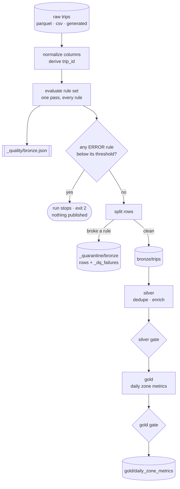

# pyspark-airflow-etl

[](https://github.com/saivarun161/pyspark-airflow-etl/actions/workflows/ci.yml)
[](https://www.python.org/downloads/)
[](https://spark.apache.org/)
[](https://airflow.apache.org/)
[](https://docs.astral.sh/ruff/)
[](LICENSE)

A PySpark ETL pipeline for NYC taxi trip data where **data-quality rules are
first-class objects that can stop the pipeline**. Bad rows are quarantined with
the reasons attached rather than silently dropped, every stage boundary leaves a
JSON report behind, and the whole thing is orchestrated by an Airflow DAG.

Most ETL projects validate data by scattering `filter` calls through the
transforms. That works until someone asks *why* Tuesday's revenue dropped 12%,
and the answer — that 40,000 rows failed a cast and vanished — is nowhere in the
code or the logs. This pipeline treats validation as its own layer, with its own
policy, its own artifacts, and its own tests.

---

## Quickstart (60 seconds, no API keys, no network)

Requires Python 3.11+ and a JDK 17 (Spark is a JVM application — `apt install
openjdk-17-jdk`, or a tarball from [Adoptium](https://adoptium.net/)).

```bash
git clone https://github.com/saivarun161/pyspark-airflow-etl.git
cd pyspark-airflow-etl

python -m venv .venv && source .venv/bin/activate
pip install -e ".[dev]"

tripetl run --rows 20000
```

That generates a synthetic-but-realistic week of trips, runs all three layers,
and prints a quality report per stage. No download, no credentials, no cluster.

```
bronze     20,400 in ->    19,749 out  quarantined=651     ok
silver     19,749 in ->    19,369 out  quarantined=0       ok
gold       19,369 in ->     1,855 out  quarantined=0       ok
--------------------------------------------------------------------
pipeline PASSED; 1,855 rows published

quality report :: bronze :: PASSED
  rows checked: 20,400   rules: 14   errors: 0   warnings: 0
  [PASS] not_null[pickup_at]: 100.0000% pass (need 100.00%)
  [PASS] ordered[pickup_at<dropoff_at]: 99.3676% pass (need 98.00%), 129 bad rows
  [PASS] in_range[trip_distance]: 99.3480% pass (need 98.00%), 133 bad rows
  [PASS] accepted_values[payment_type]: 99.2696% pass (need 98.00%), 149 bad rows
  [PASS] not_null[passenger_count]: 99.3284% pass (need 95.00%), 137 bad rows
  ...
```

Now watch a gate actually bite. Turn the defect rate past what the thresholds
tolerate:

```bash
tripetl run --rows 20000 --dirty-rate 0.3
echo $?   # 2
```

```
quality report :: bronze :: FAILED
  [FAIL] ordered[pickup_at<dropoff_at]: 94.9522% pass (need 98.00%), 1,161 bad rows
  [FAIL] in_range[trip_distance]: 95.0652% pass (need 98.00%), 1,135 bad rows
  [FAIL] accepted_values[payment_type]: 95.1391% pass (need 98.00%), 1,118 bad rows
  [PASS] not_null[passenger_count]: 95.2783% pass (need 95.00%), 1,086 bad rows
  ...
quality gate failed at stage 'bronze': ordered[pickup_at<dropoff_at], ... (7 blocking, 0 warning)
```

Note the last line: `passenger_count` is failing just as often, but it is a
`WARN` rule with a looser threshold, so it reports without blocking. That
distinction is the whole point of the severity knob.

Nothing was published. `warehouse/gold/` does not exist, and
`warehouse/_quality/bronze.json` records exactly why.

---

## Architecture



Three medallion layers, the same guard pattern between each:

| layer | does | its gate asks |
| --- | --- | --- |
| **bronze** | applies the declared schema, renames vendor columns, derives a `trip_id` | is this row *interpretable*? timestamps present and running forwards, codes from the documented set, money not negative |
| **silver** | deduplicates on `trip_id`, derives duration, speed, fare-per-mile, tip %, calendar columns | are the values we *derived* physically possible? nine miles in forty seconds parsed fine and is still wrong |
| **gold** | aggregates to one row per pickup zone per day | did the aggregation itself behave? no empty groups, no share above 1 |

---

## The quality layer

A rule is a predicate plus the policy attached to it:

```python
from tripetl.quality import rules as r
from tripetl.quality.rules import RuleSet, Severity

ruleset = RuleSet(
    name="bronze",
    row_rules=(
        r.not_null("pickup_at"),
        r.ordered("pickup_at", "dropoff_at", strict=True, threshold=0.98),
        r.accepted_values("payment_type", (1, 2, 3, 4, 5, 6), threshold=0.98),
        r.not_null("passenger_count", severity=Severity.WARN, quarantine=False),
    ),
    dataset_rules=(r.unique("trip_id"), r.row_count_at_least(1)),
)
```

Three knobs do the work:

- **`threshold`** — the fraction of rows that must pass. Real vendor feeds always
  carry a little junk; a pipeline that halts on one malformed row in twenty
  million is a pipeline someone disables. The threshold encodes how much junk is
  normal, so crossing it means *something changed upstream*.
- **`severity`** — `ERROR` stops the run, `WARN` only reports. A rule you are
  still calibrating should not be able to page someone at 3am, but you do want to
  see it every run until you decide whether it earns `ERROR`.
- **`quarantine`** — whether failing rows are diverted or carried onward. The
  chronically unreliable `passenger_count` is worth watching, not worth throwing
  away an otherwise-good fare over.

Evaluate anything, any time, without running the pipeline:

```bash
tripetl quality --path warehouse/bronze/trips --stage bronze --markdown
```

| rule | severity | status | pass rate | threshold | bad rows |
| --- | --- | --- | --- | --- | --- |
| `not_null[pickup_at]` | error | pass | 100.0000% | 100.00% | 0 |
| `ordered[pickup_at<dropoff_at]` | error | **fail** | 94.9522% | 98.00% | 1,161 |
| `in_range[trip_distance]` | error | **fail** | 95.0652% | 98.00% | 1,135 |
| `not_null[passenger_count]` | warn | pass | 95.2783% | 95.00% | 1,086 |
| `row_count_at_least` | error | pass | - | - | - |

### Quarantine, not deletion

Rows failing a quarantine-eligible rule keep every original column and gain
`_dq_failures` — an array naming **every** rule they broke, not just the first:

```
+-----------+------------+-------------+-------------------------------------------------------------------------------+
|fare_amount|payment_type|trip_distance|_dq_failures                                                                   |
+-----------+------------+-------------+-------------------------------------------------------------------------------+
|11.66      |99          |2.25         |[accepted_values[payment_type]]                                                |
|-16.25     |1           |3.37         |[non_negative[fare_amount], in_range[fare_amount], non_negative[total_amount]] |
|21.75      |1           |4.88         |[in_range[pu_location_id]]                                                     |
|13.34      |1           |1702.24      |[in_range[trip_distance]]                                                      |
+-----------+------------+-------------+-------------------------------------------------------------------------------+
```

The negative fare broke three rules at once, and all three are recorded — a row
that only reported its first failure would send you chasing one symptom.

Dropping bad rows is easy and quietly destroys the evidence needed to fix the
source. Writing them out with their reasons turns a data-quality incident into
something you can investigate: `tripetl show --path warehouse/_quarantine/bronze`
and the failure modes are right there.

---

## Schema drift

The quality rules check *values*. Before any of them run, something has to
check that the columns they name are still there, holding the types they
expect — and declaring a schema, which this pipeline does, is not that check.

Handing Spark a schema is a **projection, not an assertion**. Read a Parquet
extract with `RAW_TRIP_SCHEMA` and a column the file no longer has comes back
present and entirely null; a column the vendor added is dropped without a word;
only a type Spark cannot reconcile at all raises — from inside the scan, naming
a row group rather than the column. The all-null case is the expensive one:
every `not_null` rule on that column reports 0% and the gate blocks, so the run
*does* stop — but the report says *the data is bad* when what happened is *the
source was renamed*, and that is an hour spent looking in the wrong place.

So the run diffs the extract's stored layout against the declared one first,
before it reads a row:

```bash
tripetl schema --path yellow_tripdata_2024-01.parquet
```

```
schema check :: yellow_tripdata_2024-01.parquet :: DRIFTED
  declared: 19   stored: 19   checked: names and types   blocking: 1   advisory: 2
  [WARN ] widened[trip_distance]: declared double, stored as int
  [BLOCK] missing[fare_amount]: declared double, absent from the source
  [WARN ] unexpected[cbd_congestion_fee]: stored as double, never declared
```

Drift is graded, not pass/fail, on one question: **would it change how a row
reads?**

| kind | example | verdict |
| --- | --- | --- |
| **missing** | a declared column absent from the file | **blocks** — reads as all-null and fails a rule somewhere unrelated |
| **mismatched** | `string` where `double` was declared | **blocks** — the read fails, or the values are not what the transforms expect |
| **widened** | `int` where `double` was declared | advisory — Spark upcasts it losslessly |
| **recased** | `VENDORID` for `VendorID` | advisory — Spark resolves names case-insensitively |
| **unexpected** | the 2025 `cbd_congestion_fee` column | advisory — dropped by the declared read, and how you learn the feed grew |

Blocking drift exits **2** and writes `warehouse/_quality/input_schema.json`,
the same shape and lifecycle as a quality report: recorded before it is
enforced, so a run stopped by drift leaves behind the evidence of what moved.
`--no-schema-check` skips it; `--no-gates` downgrades it to a warning alongside
the rule gates, since a first look at an unfamiliar extract wants the whole
picture rather than a halt at the first surprise. Generated runs skip the check
entirely — the sample is built from the declared schema, so it is on-schema by
construction.

---

## Airflow

`dags/trip_etl_dag.py` maps the three stages onto three tasks:

```
bronze ──▶ silver ──▶ gold
```

Each task builds its own SparkSession, mirroring how this runs for real — three
`spark-submit` calls against a cluster, not one long-lived driver babysat by the
scheduler. A failed stage can be cleared and retried on its own.

The gates need no special Airflow machinery. A blocking rule raises
`QualityGateFailed`, the task fails, and downstream tasks never run: the mart is
simply not republished. Yesterday's numbers staying up beats today's bad numbers
going out.

```bash
pip install -e ".[dev,airflow]"
pytest tests/test_dag.py        # parses, wired in order, every knob exposed as a param
```

Airflow is an optional extra. The transforms and the quality engine import
without it, and CI enforces that by running the main suite in an environment
where Airflow is not installed at all.

---

## CLI

| command | does |
| --- | --- |
| `tripetl run` | bronze → silver → gold. `--input` for real data, omit it to generate. Exits **2** when a gate blocks |
| `tripetl quality` | evaluate a rule set against any dataset, writing nothing. `--markdown` for a pasteable table |
| `tripetl schema` | diff a raw extract's stored layout against the declared schema, writing nothing. Exits **2** on blocking drift |
| `tripetl sample` | write a synthetic raw dataset. `--dirty-rate 0` for a pristine fixture |
| `tripetl show` | print schema and rows — handy against `_quarantine/` |

Useful flags: `--no-gates` reports failures without stopping (surveys an
unfamiliar extract end to end instead of halting at the first problem);
`--no-quarantine` carries failing rows forward; `--no-schema-check` skips the
input schema comparison; `--dirty-rate` controls injected defects.

### Running against real data

The generator models the published
[NYC TLC trip record](https://www.nyc.gov/site/tlc/about/tlc-trip-record-data.page)
schema exactly, so the real extracts drop straight in:

```bash
curl -O https://d37ci6vzurychx.cloudfront.net/trip-data/yellow_tripdata_2024-01.parquet
tripetl run --input yellow_tripdata_2024-01.parquet --warehouse warehouse
```

Before it reads a row, the run compares the extract's stored layout against the
declared schema. Look before you download a month you have not seen:

```bash
tripetl schema --path yellow_tripdata_2024-01.parquet   # CONFORMS, or names what moved
```

---

## Project layout

```
src/tripetl/
  config.py           paths and policy, derived from one warehouse root
  session.py          SparkSession construction and ownership
  schema.py           explicit schemas for every layer — nothing is inferred
  sources.py          reading raw trips; schema diff; the sample generator
  pipeline.py         run_bronze / run_silver / run_gold / run_pipeline
  cli.py              tripetl
  quality/
    rules.py          Rule, DatasetRule, RuleSet, and the builders
    engine.py         evaluate() and the quarantine split()
    gate.py           enforce() and QualityGateFailed
    report.py         QualityReport — json, text, markdown
    rulesets.py       the rule sets guarding each stage
    drift.py          compare_schemas() and the SchemaDrift gate
  transforms/
    clean.py          normalize, trip_id, deduplicate
    enrich.py         duration, speed, unit economics, calendar
    aggregate.py      the gold mart
dags/trip_etl_dag.py  the Airflow DAG
tests/                141 tests
```

---

## Design decisions

**Rules are Spark `Column` expressions, not Python callables.** That is what
lets the engine check an entire rule set in one aggregation — `sum(case when
predicate then 1 else 0)` per rule, all in a single pass — instead of a filter
and a count per rule. The naive version costs a full scan per rule and gets slow
exactly when you are tempted to add more checks. A test measures it: twelve row
rules must trigger the same number of Spark jobs as one.

**Every builder produces a predicate that is never null.** Three-valued logic is
a trap here: `col < 100` is null when `col` is null, and whether that counts as a
pass then depends on how the engine happens to aggregate it. Guarding each
predicate with an explicit `isNotNull` makes null-handling a readable property of
the rule rather than an accident of the engine. `allow_null=True` opts in.

**The report is written before the gate is enforced.** A run that fails must
leave the evidence behind, or the first thing anyone does after an incident is
re-run the job — against data that may have moved on.

**A blocked gate exits 2, not 1.** A scheduler can then tell "the data was bad"
apart from "the job crashed". Those wake up different people.

**Stage functions take an optional session and only stop what they created.**
The CLI runs all three stages in one session; Airflow runs each in its own
process. Neither caller is privileged, and there is one implementation of the
logic. `getOrCreate` returns any session already live in the JVM, so a scope that
stopped whatever it was handed would tear down its caller's session — which is
precisely how a test suite starts failing three tests after the real problem.

**Schemas are declared, never inferred.** Inference costs an extra pass, and
worse, it lets an upstream change alter types silently: a month where every
`passenger_count` happens to be null arrives as `StringType`, and the downstream
arithmetic starts producing nulls instead of an error.

**The declared schema is checked, not just applied.** Declaring a schema and
handing it to the reader looks like it asserts the layout; it only projects
onto it. A dropped column reads back as all-null and fails a value rule three
stages away from the cause, so the layout is compared to the declaration
*before* the read, where a rename is one line naming the column rather than a
mystery in the numbers. The diff is graded on whether a difference changes how
a row reads — a missing column blocks, a vendor's new column does not — because
a check that halts on every harmless addition is a check someone turns off.

**Timestamps are timezone-aware at the source.** The session time zone is pinned
to UTC, but that alone is not enough — PySpark converts a *naive* Python datetime
using the **driver's local** zone, not the session zone. A generator built on
naive datetimes yields different pickup hours on a laptop in New York than on a
CI runner in UTC, and the tests asserting on those hours pass in one place and
fail in the other.

**Division guards against `Infinity`, not just zero.** Spark returns null for
integer division by zero but `Infinity` for doubles, and `Infinity` propagates
through `avg()` to poison an entire gold group. `_safe_divide` yields null, which
`avg()` excludes — the honest treatment of "we could not compute this".

**The synthetic trip key uses a null sentinel.** `concat_ws` drops nulls, so
hashing a natural key without one makes `(vendor, null, zone_20)` collide with
`(vendor, zone_20, null)` — two different trips silently becoming one.

**The worker interpreter is pinned to `sys.executable`.** Spark launches Python
workers by resolving `python3` on `PATH`, which inside a virtualenv is usually
the system Python rather than the driver's. The workers then fail on anything
version-specific, with an error that points at the wrong place entirely.

---

## Tests

```bash
pytest                      # 141 tests
pytest -m "not slow"        # skip the end-to-end warehouse runs
pytest --cov                # coverage
```

The suite runs against a real local SparkSession — one per test session, since
starting a JVM per test would make it slow enough that people stop running it.
Transform functions take a DataFrame and return a DataFrame, with no I/O and no
session of their own, so most are tested against five-row fixtures rather than a
warehouse.

CI runs four jobs: `ruff check` and `ruff format --check`; the suite on 3.11 and
3.12 against a real JDK; DAG integrity in a separate Airflow environment; and an
end-to-end demo that runs the quickstart above verbatim — including asserting
that a dirty extract exits 2 — so the published instructions cannot rot.

## License

MIT — see [LICENSE](LICENSE).
